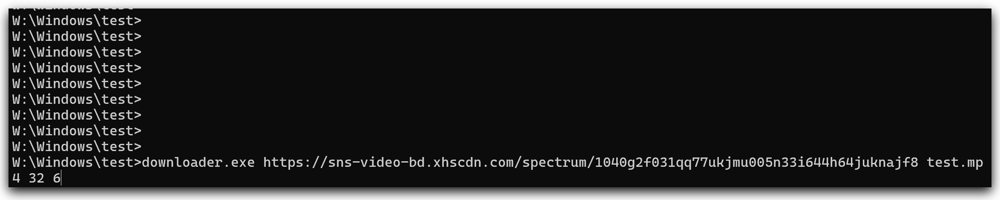

### downloader
专门用于下载大文件，对机械硬盘友好的命令行式多线程下载工具。

使用`gemini-3-pro-preview`模型生成。

### 开发背景
在下载xhs视频时，发现现有的工具比如IDM、NDM等都是分片下载，最后合并的逻辑，对速度较慢的机械硬盘非常不友好，导致机械硬盘寿命尤其是叠瓦盘不堪重负。

### 核心原理
本下载器通过 **并行下载 + 顺序写入约束** 的方式工作：

- 文件预先分配磁盘空间
- 下载阶段使用多线程并行请求小分片，并暂存在内存中
- 写入阶段始终按照文件偏移顺序写入磁盘

即使下载是乱序完成的，磁盘写入也始终是严格顺序的。

通过用有限的内存缓冲换取几乎纯顺序写入，大幅降低机械硬盘的随机写入压力，从而提升稳定性并延长硬盘寿命。

### 功能
- 断点续传
- 多线程下载
- 顺序写入
- CRC64校验文件生成 (读取服务器响应头实现)
- 使用服务器提供的文件创建时间

### 使用方法
```bat
downloader "url" "save_path" thread_count block_mb [--crc-only]
```

#### 使用16线程下载，每个线程负责4MB数据
```bat
downloader "https://sns-video-bd.xhscdn.com/spectrum/1040g2f031qq77ukjmu005n33i644h64juknajf8" "影视飓风2025相机颁奖！.mp4" 16 4
```

#### 仅生成CRC校验文件
```bat
downloader "https://sns-video-bd.xhscdn.com/spectrum/1040g2f031qq77ukjmu005n33i644h64juknajf8" "影视飓风2025相机颁奖！.mp4" 16 4 --crc-only
```

#### 检验CRC64
需要配合 [crc64ecma](../crc64ecma/) 工具实现：
```bat
crc64ecma "影视飓风2025相机颁奖！.mp4.crc64"
```

#### 动图演示
